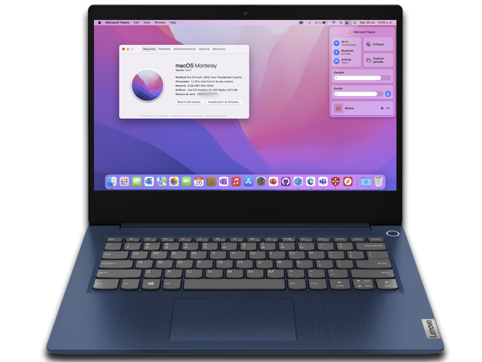

# Lenovo ideapad 3 14iil05 Hackintosh

EFI file for Lenovo Ideapad 3 14IIL05 forked from DagerDW's repo.

# Notes
Use of this EFI for Lenovo Ideapad 3 14iil05 laptop is your responsibility, if there's installation damage or your warranty is void don't blame me. It was you who took the decision to install it, not me.

# Bootloader
Based on [OpenCore 0.7.4](https://github.com/acidanthera/OpenCorePkg)

# Specs
- <b>CPU</b>: [Intel i3-1005G1](https://ark.intel.com/content/www/us/en/ark/products/196588/intel-core-i3-1005g1-processor-4m-cache-up-to-3-40-ghz.html) Ice Lake-U
- <b>GPU</b>: Intel® UHD G1 Graphics for 10th Gen Intel® Processors
- <b>Storage</b>: Lenovo Toshiba BG4 256GB M.2 PCIe 2242 KBG40ZNT256G NVME SSD 
- <b>RAM</b>: 8 GB DDR4 2667Mhz (2x 4GB memory slots)
- <b>Screen</b>: 13.9-inch
- <b>Wifi</b>: Intel AC 9560 Wi-Fi 6 AX201 160MHz card
- <b>Trackpad</b>: Synaptics SYNA001 I2C HID
- <b>Ports</b>: 1 x USB 2.0, 2 x USB 3.0, USB 2.0 SD Card Reader, HDMI Display Port, 3,5mm Jack Audio
- <b>Audio</b>: Realtek ALC230 (AppleALC layout id 20)

# What's working
- CPU power management 
- Restart, sleep and shutdown
- Graphics acceleration
- Battery
- Usb Ports
- Speakers, mic and output Audio ALC230
- Wi-Fi & Bluetooth
- Internal webcam
- Trackpad with fully working gestures
- Screen Brightness and Fn Hotkeys (via YogaSMC)
- App store/iMessage/Facetime/icloud

# What's not working
- HDMI port (Unable to make it work. Issue with Ice Lake processors)
- Airdrop (Known issue with intel wifi cards)

# BIOS Settings
Before starting, make sure to update the BIOS [here](https://pcsupport.lenovo.com/id/en/products/laptops-and-netbooks/3-series/ideapad-3-14iil05/downloads/driver-list/), then when the Lenovo logo is shown, press <b>F2</b>, when thr BIOS settings are displayes, please go to: 
- "Configuration" <b>SATA Controller Mode</b> set to <b>AHCI</b>, <b>HotKey Mode</b> set to <b>Enabled</b>.
- "Security" <b>Intel Platform Trust Technology</b> set to <b>Disabled</b>, <b>Intel SGX</b> set to <b>Disabled</b>, <b>Secure Boot</b> set to <b>Disabled</b>.
- "Boot" <b>Boot Mode</b> set to <b>UEFI</b>,<b>Fast Boot</b> set to <b>Disabled</b>, <b>USB Boot</b> set to <b>Enabled</b>.
- "Exit" <b>OS Optimized Defaults</b> set to <b>Disabled</b>.

# Additional Settings
- The SMBios data in the config.plist file is invalid and it won't boot if it's left unchanged. This must be set by yourself using your own SMBios or else you may encounter issues with App Store or iMessage. You can read the Dortania's OpenCore guide for instructions about how to setup your own SMBios [here](https://dortania.github.io/OpenCore-Install-Guide/config-laptop.plist/icelake.html#platforminfo)

# Notes
- The EFi folders provided are tested to work with both Big Sur and Monterey. The OpenCore version and Kexts are up to date and beta updates for Monterey should work without the need of any additional SMBios change.

# Original Credits
- [Apple](https://www.apple.com) for macOS.
- [Acidanthera](https://github.com/acidanthera) for most of the kexts.
- [RehabMan](https://github.com/RehabMan) for some ACPI patches.
- [Hackintosh Lovers](https://t.me/HackintoshLover) for the help.
- [Olarila](https://www.olarila.com) for guides.
- Anyone else not named here
